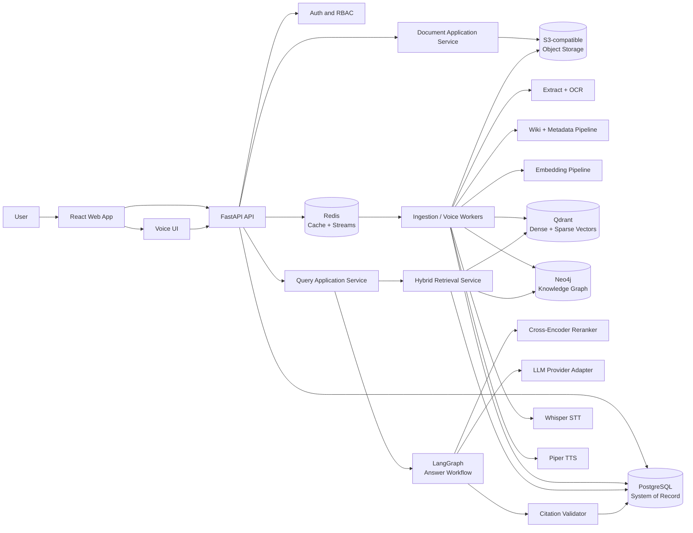
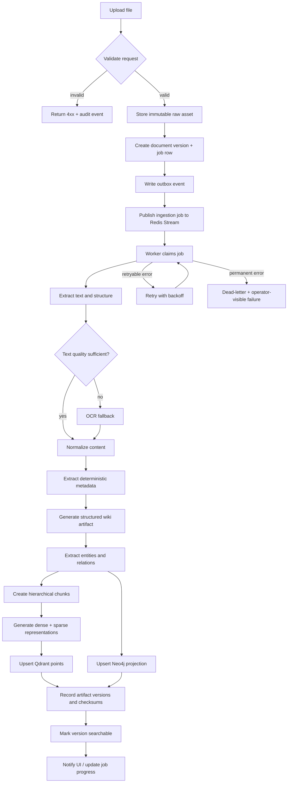
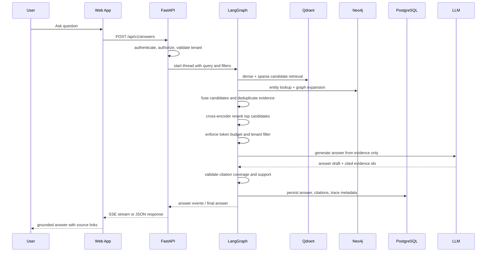
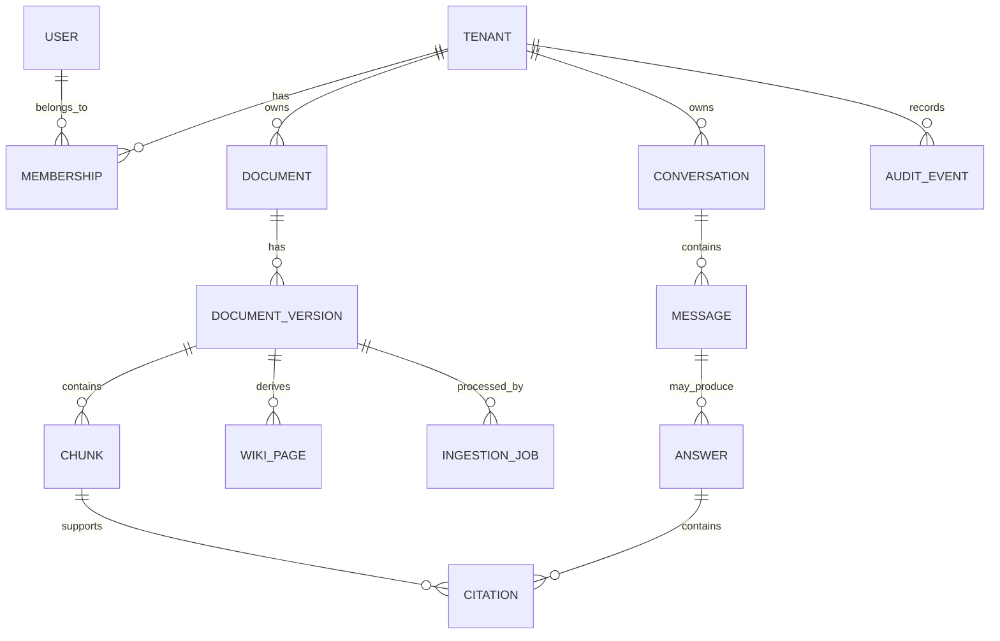
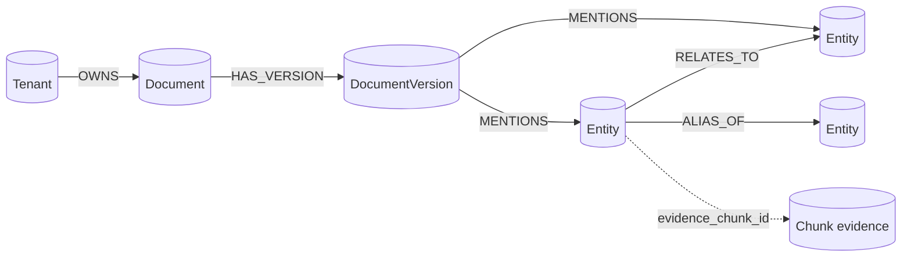

# OpenWikiRAG: End-to-End Engineering and Learning Guide

**Status:** implementation blueprint  
**Version:** 0.1  
**Date:** 2026-08-07  
**Normative source:** `OpenWikiRAG Master Project Context & Engineering Specification v1.0` supplied with this project

This document explains what OpenWikiRAG is, why each subsystem exists, how data moves through it, how we will implement it, and how we will prove that it works. It is intentionally both an architecture document and a learning contract.

We will implement the project in independent phases. At the end of every phase we will stop for a Q&A checkpoint: you will explain the subsystem in your own words, ask questions, inspect the evidence, and only then will we move forward.

---

## 1. The project in one sentence

OpenWikiRAG turns an enterprise document collection into a tenant-isolated, versioned knowledge system that combines generated wiki pages, a knowledge graph, hybrid retrieval, reranking, and citation-grounded answers, with voice as another input/output channel.

It is an enterprise knowledge platform, not a chatbot.

The core idea is:

```text
raw documents
    -> normalized document versions
    -> structured wiki pages + entities + relations
    -> hierarchical chunks + dense/sparse indexes
    -> graph-aware hybrid retrieval
    -> reranked evidence context
    -> answer with source citations
    -> optional voice input/output
```

The system preserves relationships and provenance that ordinary “split a PDF into chunks and call an LLM” applications throw away.

---

## 2. What this project demonstrates

The finished repository should make these engineering skills visible:

- backend API design with FastAPI, typed contracts, dependency injection, and async I/O;
- asynchronous distributed processing with durable jobs, retries, idempotency, and backpressure;
- information retrieval: lexical search, dense embeddings, hybrid fusion, and reranking;
- knowledge representation: entities, relations, provenance, and graph traversal;
- RAG system design: context selection, token budgets, grounding, and citations;
- data modeling across a transactional database, object storage, graph database, and vector database;
- multi-tenant security and RBAC;
- evaluation driven development rather than “the demo felt good”;
- observability with correlated logs, traces, metrics, and model/retrieval telemetry;
- production packaging with Docker, CI, reproducible local development, and deployment documentation.

The resume story must be based on measured results. We will never invent latency, accuracy, scale, or cost numbers. The repository will contain the benchmark and the command that produced every reported number.

### Non-goals

OpenWikiRAG is not intended to become:

- a ChatGPT clone;
- a single PDF chatbot;
- a thin LangChain demo;
- a CRUD app with an LLM endpoint;
- a collection of microservices created before there is evidence that they are needed;
- an ungrounded “agent” that can fabricate enterprise facts.

---

## 3. The mental model: four planes

Thinking in planes makes the system easier to explain in interviews.

| Plane | Responsibility | Primary systems |
| --- | --- | --- |
| Control plane | tenants, users, permissions, document lifecycle, jobs, configuration, audit events | PostgreSQL |
| Data plane | raw files and normalized artifacts | S3-compatible object storage, PostgreSQL |
| Knowledge plane | wiki pages, entities, relations, evidence links | PostgreSQL, Neo4j |
| Retrieval and answer plane | dense/sparse search, graph expansion, reranking, generation, citations | Qdrant, Neo4j, LangGraph, model adapters |

The planes are connected by explicit interfaces. A component may be replaced without changing the domain model. For example, Qdrant can be replaced by another vector engine because the application depends on a `VectorIndex` port, not on Qdrant calls scattered through controllers.

---

## 4. System architecture

We will start with a **modular monolith plus separately scalable workers**:

- `api`: stateless FastAPI HTTP/SSE application;
- `worker`: one or more processes that consume ingestion and voice jobs;
- `web`: React/TypeScript frontend;
- `postgres`: system of record and transactional metadata;
- `object store`: original files and large generated artifacts;
- `qdrant`: derived dense/sparse search index;
- `neo4j`: derived relationship graph;
- `redis`: cache, rate-limit counters, and Redis Streams job transport;
- `llm/embedding/stt/tts providers`: behind application-owned interfaces.

This is intentionally not a microservice architecture on day one. The domain modules are separated in code and have independent operational boundaries where it matters. We can split a module into a service later if measurements show a need for independent scaling, deployment, or ownership.

### High-level component diagram



### Why this shape

1. PostgreSQL gives us transactions, constraints, migrations, and a reliable source of truth.
2. Object storage is appropriate for original files and audio; databases should not hold large binary blobs unnecessarily.
3. Qdrant is optimized for vector retrieval and supports named dense/sparse vectors in one point.
4. Neo4j is optimized for relationship traversal and graph-shaped context.
5. Redis Streams gives the first version durable-enough asynchronous delivery, consumer groups, acknowledgements, retries, replay, and bounded retention without operating Kafka before we need Kafka.
6. FastAPI keeps the API typed and easy to test while allowing async I/O where the client libraries support it.
7. LangGraph is used where resumability, streaming, checkpoints, and explicit workflow state have value: the answer workflow. We will not hide every deterministic ingestion function inside an agent abstraction.

---

## 5. End-to-end workflows

### 5.1 Document ingestion workflow



Important property: **the document version is canonical; graph and vector records are rebuildable projections**. If the embedding model changes, we can regenerate vectors from the stored normalized content. If the graph schema changes, we can rebuild Neo4j from PostgreSQL artifacts.

### 5.2 Question-answer workflow



### 5.3 Voice workflow

The first voice version is deliberately an asynchronous batch pipeline:

```text
browser records audio
    -> upload audio asset
    -> STT job
    -> transcript enters the same text query path
    -> grounded text answer
    -> TTS job
    -> playable audio asset
```

Real-time, duplex voice is a later phase because it introduces streaming audio transport, partial transcripts, interruption handling, latency budgets, and more demanding observability. We will first build a correct shared text path, then optimize the transport.

---

## 6. Core concepts you must be able to explain

### Retrieval-Augmented Generation (RAG)

RAG separates **finding evidence** from **writing an answer**. The model does not receive the whole enterprise corpus. A retriever selects a small evidence set, and a generator answers using that set.

The basic quality equation is:

```text
answer quality = retrieval recall × context quality × generation faithfulness
```

If the right passage is never retrieved, a better prompt cannot fix the problem. If the right passage is retrieved but the context is too large or contradictory, the generator can still fail. Therefore we measure retrieval and generation separately.

### WikiRAG

WikiRAG creates a navigable, structured representation before retrieval:

- document summary;
- sections and hierarchy;
- definitions and key terms;
- entities and relations;
- links back to exact evidence;
- page/version metadata.

The wiki is not allowed to replace the source document. It is a derived navigation and reasoning layer. Every generated field stores provenance and a source version.

### Dense retrieval

A dense embedding maps text to a vector. Similarity search finds semantically related passages even when the query and passage use different words. Dense search is good for paraphrases and conceptual questions but can miss exact identifiers, error codes, product names, and legal phrases.

### Sparse / lexical retrieval

Sparse retrieval represents terms and their importance. It is good at exact keywords, rare names, identifiers, and terminology. It can miss paraphrases and requires thoughtful tokenization and language handling.

### Hybrid retrieval

Hybrid retrieval runs dense and sparse retrieval over the same corpus, then fuses the ranked lists. We will use Reciprocal Rank Fusion as the first explainable baseline:

```text
RRF(d) = sum over retrieval legs r of 1 / (k + rank_r(d))
```

The constant `k` and candidate limits will be configuration, not magic numbers hidden in code. We will compare RRF with weighted fusion during evaluation rather than assuming one is universally best.

### Reranking

Initial retrieval is optimized for recall and speed. A cross-encoder reranker reads the query and each candidate together, producing a more precise relevance score for a smaller candidate set. This is a second-stage operation because running it over the entire corpus would be too expensive.

### Knowledge graph retrieval

A knowledge graph stores explicit entities and typed relationships. Graph retrieval is useful for questions such as:

- “Which service owns the component that depends on X?”
- “What policies are related to this system?”
- “How are these two concepts connected?”

The graph is not a replacement for text evidence. It helps discover connected sources and multi-hop context; the final answer still cites source document versions and chunks.

### Grounding and citations

Grounding means the answer is supported by retrieved evidence. A citation is not merely a URL at the bottom of a response. Each answer claim should point to an evidence record containing:

- tenant id;
- document id and version;
- chunk id;
- page/section/character offsets when available;
- source asset location;
- retrieval method and score;
- graph evidence when a relation contributed.

If evidence is insufficient, the correct answer is “I could not find enough evidence in the indexed sources,” not a confident guess.

### Idempotency and at-least-once delivery

Workers can receive a job more than once after a timeout or crash. Every job handler must be safe to retry. The combination of `job_id`, `document_version_id`, `pipeline_version`, and a deterministic content hash is used to detect duplicate work. A successful side effect must be recorded before acknowledgement.

### Source of truth versus projection

PostgreSQL owns business state. Neo4j and Qdrant are indexes/projections. This prevents a vendor-specific index from becoming the only copy of an enterprise fact and makes reindexing a normal operational workflow.

### Tenant isolation

Every request, row, object key, graph query, and vector filter carries a tenant boundary. Tenant isolation is defense in depth:

1. authorize at the API;
2. apply tenant-aware repository filters;
3. enforce PostgreSQL row-level security where applicable;
4. include `tenant_id` in Qdrant payload filters;
5. include tenant properties in Neo4j match clauses;
6. test cross-tenant reads explicitly.

---

## 7. Technology choices and trade-offs

| Concern | Initial choice | Why | Deliberate trade-off |
| --- | --- | --- | --- |
| API | FastAPI + Pydantic | typed request/response contracts, OpenAPI, Python ML ecosystem | Python is not the best choice for every CPU-bound workload; heavy inference is isolated in workers |
| Frontend | React + TypeScript + Tailwind CSS | mature component model, typed API consumption, fast UI iteration | requires a real design system; Tailwind is not a substitute for accessibility or visual discipline |
| Workflow | LangGraph | explicit stateful answer graph, streaming, persistence, resumability | adds runtime concepts; deterministic domain services remain ordinary Python |
| System of record | PostgreSQL | transactions, constraints, migrations, indexes, RLS | graph/vector queries are not forced into SQL |
| Blob storage | S3-compatible storage; MinIO locally | durable file/audio storage and production portability | introduces an additional service and object lifecycle policy |
| Vector search | Qdrant | named dense/sparse vectors, payload filters, hybrid queries, reranking path | it is not a knowledge graph or general full-text engine |
| Graph | Neo4j | expressive traversal and relationship modeling | graph is a projection that must be rebuilt and tenant-filtered carefully |
| Jobs/cache | Redis Streams + Redis cache | consumer groups, acknowledgements, replay, retention, low local setup cost | for very large retention or throughput, Kafka/Pulsar may be a better fit |
| STT | Whisper adapter | reproducible local baseline and broad language support | model size affects CPU/GPU cost and latency |
| TTS | Piper adapter | local, fast, replaceable voice backend | voice quality/language coverage depends on the selected model |
| Local deployment | Docker Compose | one reproducible developer environment | not the production scheduler |
| Production path | container images, managed services, later Kubernetes | operational separation and horizontal scaling | Kubernetes is deferred until load and operational evidence justify it |
| Observability | OpenTelemetry + Prometheus-compatible metrics + structured logs | vendor-neutral correlation of traces, metrics, and logs | requires instrumentation discipline from the first phase |

### Research-backed sources

These are primary documentation links used for the choices above and should be rechecked when implementation versions are pinned:

- [FastAPI async/concurrency](https://fastapi.tiangolo.com/async/) and [deployment concepts](https://fastapi.tiangolo.com/deployment/concepts/)
- [LangGraph overview](https://langchain-ai.github.io/langgraph/) and [persistence](https://langchain-ai.github.io/langgraph/concepts/persistence/)
- [Qdrant hybrid search](https://qdrant.tech/documentation/search/text-search/hybrid-search/) and [production checklist](https://qdrant.tech/documentation/production-checklist/)
- [Neo4j hybrid search](https://neo4j.com/developer/genai-ecosystem/hybrid-search/)
- [PostgreSQL row security](https://www.postgresql.org/docs/current/ddl-rowsecurity.html)
- [Redis Streams and consumer groups](https://redis.io/docs/latest/develop/use-cases/streaming/)
- [Docker Compose](https://docs.docker.com/compose/)
- [React with TypeScript](https://react.dev/learn/typescript) and [TypeScript strict mode](https://www.typescriptlang.org/tsconfig/strict)
- [OpenTelemetry documentation](https://opentelemetry.io/docs/) and [Python instrumentation](https://opentelemetry.io/docs/languages/python/instrumentation/)
- [OpenAI Whisper repository](https://github.com/openai/whisper)
- [Piper voice repository](https://github.com/OHF-Voice/piper1-gpl)

We will record the exact versions in lock files and in a later `docs/adr/` decision record. The guide avoids claiming that a particular library version is “latest”; reproducibility comes from pinning and CI.

---

## 8. Domain model and data ownership

### 8.1 Canonical entities

| Entity | Meaning | Important fields |
| --- | --- | --- |
| `tenant` | isolated organization/workspace | `id`, `name`, `status`, timestamps |
| `user` | authenticated human or service identity | `id`, `email`, `auth_provider_subject`, status |
| `membership` | user-to-tenant relationship | `tenant_id`, `user_id`, role |
| `document` | logical document identity | `tenant_id`, title, source type, current version |
| `document_version` | immutable uploaded/normalized revision | content hash, source asset, status, pipeline version |
| `source_asset` | raw file or audio object | object key, MIME, byte size, checksum |
| `wiki_page` | derived structured knowledge page | version, title, sections, provenance |
| `chunk` | evidence-bearing retrieval unit | version, parent chunk, text, offsets, token count |
| `entity` | canonical named concept | tenant, normalized name, type |
| `relation` | typed entity relationship | source entity, target entity, type, evidence |
| `ingestion_job` | asynchronous processing attempt | state, step, attempts, lease, error |
| `pipeline_run` | reproducibility record | pipeline version, model versions, config hash |
| `conversation` | user-visible dialogue | tenant, owner, title, retention policy |
| `message` | user/assistant/tool event | role, content, citations, token metadata |
| `answer` | final answer artifact | query, evidence set, model, validation outcome |
| `citation` | claim-to-evidence link | answer, claim index, chunk, offsets, score |
| `audit_event` | security and lifecycle record | actor, action, resource, outcome, request id |

### 8.2 Relational model sketch



Rules:

- use UUIDs for externally visible ids;
- use foreign keys and unique constraints to make illegal states difficult;
- put `tenant_id` on every tenant-owned table even when it is derivable, because it makes filtering and RLS auditable;
- make document versions immutable after normalization; a new upload creates a new version;
- store provider/model/prompt/config versions on derived artifacts;
- use migrations, never ad-hoc schema changes in application startup;
- use soft deletion for user-visible data and a separate retention/purge process for hard deletion.

### 8.3 Graph model sketch



Neo4j properties include `tenant_id`, stable ids from PostgreSQL, and evidence references. Graph writes are upserts keyed by canonical ids. Deleting or superseding a document version removes or tombstones only the projection belonging to that version.

### 8.4 Qdrant point model

Each point corresponds to a chunk or a deliberately chosen parent chunk:

```json
{
  "id": "chunk_uuid",
  "vector": {
    "dense": "dense embedding",
    "sparse": "lexical sparse vector"
  },
  "payload": {
    "tenant_id": "tenant_uuid",
    "document_id": "document_uuid",
    "document_version_id": "version_uuid",
    "chunk_id": "chunk_uuid",
    "title": "section title",
    "source_type": "pdf",
    "page_start": 4,
    "page_end": 5,
    "language": "en",
    "pipeline_version": "ingestion-v1"
  }
}
```

Every search must apply a tenant filter. Payload fields used in filters must have indexes. The Qdrant point is never the only copy of chunk text or source metadata.

---

## 9. API contract

All public routes are versioned under `/api/v1`. API handlers validate input, authorize access, call an application service, and translate domain errors into a stable error envelope. Business logic does not live in route functions.

### 9.1 Core routes

| Method | Route | Purpose | Expected behavior |
| --- | --- | --- | --- |
| `GET` | `/healthz` | liveness | process is alive; no dependency calls |
| `GET` | `/readyz` | readiness | checks required dependencies and reports degraded state |
| `POST` | `/auth/register` | local development auth | disabled or replaced by OIDC in production |
| `POST` | `/auth/token` | access/refresh token | rate limited; never logs credentials |
| `GET` | `/me` | current identity and memberships | tenant context is explicit |
| `POST` | `/documents` | upload a document | stores asset and returns `202` with job id |
| `GET` | `/documents` | list authorized documents | paginated, tenant-filtered |
| `GET` | `/documents/{document_id}` | document details | includes current version/job state |
| `POST` | `/documents/{document_id}/reindex` | rebuild projections | idempotent by version and pipeline hash |
| `GET` | `/jobs/{job_id}` | job progress | safe to poll; exposes step and retry status |
| `POST` | `/search` | evidence search without generation | useful for debugging and evaluation |
| `POST` | `/answers` | grounded answer | JSON or Server-Sent Events stream |
| `GET` | `/answers/{answer_id}` | retrieve persisted answer | includes citations and evidence metadata |
| `POST` | `/conversations` | create conversation | owner/tenant authorization required |
| `GET` | `/conversations/{id}` | read conversation | retention and tenant checks apply |
| `POST` | `/voice/transcriptions` | submit audio for STT | returns asynchronous job |
| `POST` | `/voice/synthesis` | submit text for TTS | returns audio job/object reference |

### 9.2 Answer request and response shape

```json
{
  "conversation_id": "optional_uuid",
  "query": "Which services depend on the identity gateway?",
  "filters": {
    "document_ids": [],
    "source_types": ["pdf", "markdown"],
    "as_of": null
  },
  "mode": "grounded",
  "stream": true
}
```

```json
{
  "answer_id": "answer_uuid",
  "status": "complete",
  "answer": "...",
  "citations": [
    {
      "citation_id": "citation_uuid",
      "claim": "The identity gateway is used by ...",
      "document_id": "document_uuid",
      "document_version_id": "version_uuid",
      "chunk_id": "chunk_uuid",
      "label": "Identity Architecture, p. 4",
      "page_start": 4
    }
  ],
  "quality": {
    "grounding_status": "supported",
    "retrieval_candidates": 40,
    "selected_evidence": 8
  }
}
```

### 9.3 Error contract

Use one machine-readable envelope:

```json
{
  "error": {
    "code": "DOCUMENT_UNSUPPORTED_MEDIA_TYPE",
    "message": "The uploaded file type is not supported.",
    "request_id": "request_uuid",
    "details": {}
  }
}
```

Do not expose stack traces, provider secrets, raw prompts, or internal database errors to clients.

### 9.4 API design rules

- `POST` upload and job-start operations accept an `Idempotency-Key`;
- pagination is cursor-based where the collection can grow large;
- long-running work returns `202 Accepted` and a job resource;
- answer streaming uses SSE first because it is simple to observe and proxy;
- generated content is explicitly marked as `derived` and never confused with uploaded source content;
- OpenAPI is generated from the typed routes and checked in CI for accidental breaking changes.

---

## 10. Application and repository structure

The repository should remain understandable to a new engineer:

```text
openwikirag/
├── apps/
│   ├── api/
│   │   ├── app/
│   │   │   ├── main.py
│   │   │   ├── api/                 # HTTP routes and dependencies
│   │   │   ├── core/                # settings, security, logging
│   │   │   ├── domain/              # entities, value objects, ports
│   │   │   ├── application/         # use cases / orchestration
│   │   │   ├── infrastructure/      # Postgres, Redis, Qdrant, Neo4j adapters
│   │   │   └── workflows/            # LangGraph answer graph
│   │   └── tests/
│   │       ├── unit/
│   │       ├── integration/
│   │       └── contract/
│   └── worker/
│       ├── app/
│       │   ├── main.py
│       │   ├── consumers/
│       │   ├── jobs/
│       │   └── pipelines/
│       └── tests/
├── web/
│   ├── src/
│   │   ├── app/
│   │   ├── components/
│   │   ├── features/
│   │   ├── lib/
│   │   └── types/
│   └── tests/
├── packages/
│   └── contracts/                   # generated or shared API types
├── migrations/                      # PostgreSQL migrations
├── infra/
│   ├── compose/
│   ├── neo4j/
│   ├── qdrant/
│   └── observability/
├── evals/
│   ├── datasets/
│   ├── runners/
│   └── reports/
├── scripts/
├── docs/
│   ├── OPENWIKIRAG_ENGINEERING_GUIDE.md
│   └── adr/
├── .github/workflows/ci.yml
├── pyproject.toml
├── uv.lock
├── package.json
├── docker-compose.yml
├── .env.example
└── README.md
```

### Dependency direction

```text
api routes -> application use cases -> domain ports
                                      ^
                         infrastructure adapters implement ports

worker consumers -> job handlers -> application use cases -> domain ports
```

The domain layer must not import FastAPI, SQLAlchemy, Qdrant, Neo4j, Redis, or a specific LLM SDK. This is the practical enforcement of “every component should be replaceable.”

---

## 11. Implementation plan: build, learn, prove

Each phase has four outputs:

1. a working feature;
2. automated tests;
3. documentation and an architecture decision record where relevant;
4. a benchmark or observable proof.

### The learning loop for every phase

Before coding:

1. explain the problem and the data flow;
2. define the smallest vertical slice;
3. identify failure modes and acceptance criteria.

During coding:

1. implement one small change;
2. run the focused test;
3. inspect the database/event/trace output;
4. explain why the code is shaped that way.

At the checkpoint:

1. run the complete phase test suite;
2. inspect the generated artifact or API response;
3. review the trade-off and one rejected alternative;
4. do a Q&A before beginning the next phase.

### Phase 0 — Engineering foundation

**Goal:** make the empty repository reproducible, testable, and ready for incremental work.

Build:

- repository conventions, Python and frontend lockfiles;
- Docker Compose for PostgreSQL, Redis, Neo4j, Qdrant, object storage, and optional observability;
- environment validation and `.env.example`;
- API and worker health endpoints;
- structured logging with request/correlation ids;
- base CI: formatting, linting, type checking, unit tests, and Compose smoke test;
- initial ADRs: modular monolith, source-of-truth/projections, job transport.

Learn:

- process versus container;
- health versus readiness;
- configuration as an external contract;
- why lockfiles and CI are part of application code.

Proof:

- a new machine can run one documented command to start dependencies;
- CI runs without manual steps;
- API and worker emit correlated structured logs.

### Phase 1 — Identity, tenants, and RBAC

**Goal:** every later feature has a security boundary.

Build:

- user, tenant, membership, role, and audit tables;
- local development auth with a provider interface designed for OIDC;
- access token validation and refresh flow;
- roles such as `viewer`, `editor`, and `admin`;
- repository-level tenant filters;
- PostgreSQL RLS policies where applicable;
- cross-tenant access tests.

Learn:

- authentication versus authorization;
- claims, sessions, refresh tokens, and token revocation;
- RBAC versus ABAC;
- why application checks alone are not enough for tenant data.

Proof:

- a viewer cannot upload or delete;
- a user from tenant A cannot read tenant B's documents, jobs, vectors, or graph-derived answer;
- every protected operation creates an audit record.

### Phase 2 — Document upload and durable job lifecycle

**Goal:** accept a file safely and process it asynchronously.

Build:

- multipart upload with MIME sniffing, size limits, checksum, and filename sanitization;
- object storage adapter;
- `document`, `document_version`, and `ingestion_job` tables;
- transactional outbox event;
- Redis Stream producer and consumer group;
- job lease, retry, backoff, acknowledgement, and dead-letter behavior;
- job progress endpoint.

Learn:

- why a long-running task should not run in an HTTP request;
- transactional outbox and the dual-write problem;
- at-least-once delivery and idempotent handlers;
- retryable versus permanent failure.

Proof:

- upload returns `202` quickly;
- killing a worker causes the job to be reclaimed;
- a duplicate delivery does not create duplicate document versions;
- failed jobs are visible and actionable.

### Phase 3 — Text extraction, normalization, and OCR

**Goal:** convert supported files into deterministic normalized content.

Build:

- extractor interface for PDF, Markdown, plain text, and DOCX;
- page/section/character offset preservation;
- text quality classifier;
- OCR fallback for scanned PDFs;
- normalized document artifact with parser version and checksum;
- fixtures for malformed, empty, encrypted, huge, and image-only documents.

Learn:

- why provenance starts at extraction;
- OCR error modes and confidence;
- canonicalization and content hashing;
- backpressure for CPU-heavy work.

Proof:

- the same input and parser version produce the same normalized artifact;
- extracted spans link back to page/section information;
- OCR is used only when text extraction quality is inadequate.

### Phase 4 — Metadata extraction and WikiRAG pages

**Goal:** turn normalized content into a structured, versioned knowledge page.

Build:

- deterministic metadata first: title, language, headings, dates, authors, source type;
- optional LLM structured extraction behind a provider interface;
- Pydantic schemas for wiki pages, sections, definitions, and references;
- page versioning and provenance per field/section;
- prompt/model/config hashes;
- human-review status and regeneration endpoint.

Learn:

- structured generation versus free-form generation;
- schema validation and partial failure;
- derived artifacts versus source facts;
- prompt injection in untrusted documents: document text is data, not instructions.

Proof:

- malformed model output is rejected or repaired without corrupting the source;
- a reviewer can compare two generated page versions;
- every summary/definition links to evidence spans.

### Phase 5 — Hierarchical chunking and embeddings

**Goal:** create retrieval units that preserve document structure.

Build:

- heading-aware parent/child chunks;
- token and character budgets;
- overlap rules that do not duplicate entire sections;
- stable chunk ids based on version and content hash;
- embedding provider interface;
- dense and sparse representations;
- batch embedding, concurrency limits, and model cache;
- Qdrant collection schema and payload indexes.

Learn:

- chunk size as a retrieval/latency trade-off;
- dense versus sparse representations;
- vector dimensionality and distance metrics;
- why changing an embedding model requires a new index namespace or rebuild;
- batching and rate limiting.

Proof:

- chunk fixtures show preserved headings and source offsets;
- re-running a pipeline does not create duplicate points;
- the exact model and pipeline version are queryable.

### Phase 6 — Hybrid retrieval and reranking

**Goal:** expose a search endpoint that can be measured independently of answer generation.

Build:

- query normalization and filter validation;
- dense retrieval path;
- sparse retrieval path;
- rank fusion with configurable RRF;
- deduplication by chunk/document version;
- cross-encoder reranking over a bounded candidate set;
- search explanations for development: which leg found each result and why it survived;
- `/api/v1/search` API.

Learn:

- recall versus precision;
- candidate generation versus reranking;
- RRF and score normalization;
- the danger of tuning against one anecdotal query;
- index filtering and tenant isolation.

Proof:

- dense-only, sparse-only, hybrid, and reranked results are comparable;
- a labeled query set produces Recall@k, MRR, and nDCG reports;
- exact identifiers are not lost when semantic wording changes.

### Phase 7 — Knowledge graph construction and graph-aware retrieval

**Goal:** add relationship context without making the graph the only truth.

Build:

- entity/relation schemas with evidence references;
- deterministic normalization and deduplication of entity names;
- Neo4j projection writer with idempotent `MERGE` semantics;
- tenant-aware graph queries;
- seed entities from retrieved chunks;
- bounded one- and two-hop expansion;
- graph evidence merged with text evidence;
- graph rebuild command from PostgreSQL artifacts.

Learn:

- property graphs and Cypher;
- entity resolution;
- traversal depth and combinatorial explosion;
- graph projection/rebuild patterns;
- why “more graph context” can reduce answer quality.

Proof:

- a relationship question retrieves connected evidence that dense-only retrieval misses;
- deleting/rebuilding the projection is safe;
- cross-tenant graph traversal tests fail closed.

### Phase 8 — LangGraph answer workflow and citation validation

**Goal:** produce an answer that is streamed, persisted, and grounded.

Build:

- typed workflow state;
- nodes for authorization context, retrieval, graph expansion, fusion, rerank, context budgeting, generation, and citation validation;
- checkpointer and conversation thread id;
- model adapter with timeout, retry, and provider error mapping;
- answer streaming over SSE;
- citation builder and claim/evidence validation;
- insufficient-evidence response path;
- answer artifact persistence.

Learn:

- state machines versus opaque agent loops;
- checkpoints and resumability;
- context windows and token budgets;
- prompt injection defense;
- faithfulness, citation coverage, and refusal behavior.

Proof:

- the same query can be inspected node by node;
- an LLM timeout produces a recoverable error and does not lose the job/answer state;
- answers contain citations whose chunks exist and belong to the requesting tenant;
- unsupported questions are explicitly marked unsupported.

### Phase 9 — Conversations and memory

**Goal:** make multi-turn use useful without leaking or over-storing user information.

Build:

- conversation/message persistence;
- short-term thread state through the workflow checkpointer;
- bounded conversation context summarization;
- explicit long-term memory opt-in and deletion;
- conversation-level access control;
- cache keys that include tenant, user scope, query, filters, and model/index versions.

Learn:

- state versus memory;
- cache invalidation and versioned cache keys;
- retention and deletion;
- why conversation history is not automatically factual enterprise knowledge.

Proof:

- a conversation resumes after API restart;
- users cannot load another user's conversation;
- a deleted conversation is removed from the user-visible path and scheduled for purge.

### Phase 10 — Voice input and output

**Goal:** support voice through the same grounded answer path.

Build:

- browser audio capture and upload;
- audio validation and object storage;
- Whisper STT worker job with transcript confidence/segments;
- transcript review/debug view;
- TTS job with Piper adapter;
- generated audio retention and authorization;
- latency/error metrics for STT and TTS.

Learn:

- audio formats, sampling, duration limits, and CPU/GPU cost;
- asynchronous media workflows;
- transcript uncertainty;
- why voice should reuse the text query contract.

Proof:

- voice question and typed question produce the same answer workflow events;
- audio objects cannot be accessed across tenants;
- a failed TTS job does not invalidate the persisted grounded text answer.

### Phase 11 — Evaluation, observability, security, and performance

**Goal:** turn a working demo into evidence of engineering quality.

Build:

- golden dataset and repeatable eval runner;
- retrieval, grounding, citation, latency, cost, and failure metrics;
- OpenTelemetry traces across API -> job -> retrieval -> model provider;
- structured logs with redaction;
- Prometheus-compatible metrics and dashboards;
- rate limits, payload limits, secret handling, dependency scanning;
- load tests for upload, search, answer, and worker throughput;
- threat model and incident playbook.

Learn:

- SLOs, SLIs, and error budgets;
- tail latency and queueing theory;
- observability cardinality;
- security boundaries and abuse cases;
- performance optimization from measurements.

Proof:

- one request id links API logs, worker logs, and model/retrieval spans;
- every benchmark is reproducible from a command;
- load tests identify the first bottleneck and the selected mitigation.

### Phase 12 — Deployment and resume polish

**Goal:** package the work as a credible flagship project.

Build:

- production-like container images with non-root users and multi-stage builds;
- CI gates and release artifacts;
- deployment topology and secret-management guide;
- backup/restore and reindex runbooks;
- architecture decision records;
- demo dataset and seeded walkthrough;
- architecture diagram, evaluation report, and incident simulation;
- resume bullets based only on measured results.

Learn:

- immutable artifacts;
- zero-downtime migration concerns;
- backup versus restore testing;
- operational readiness and technical storytelling.

Proof:

- a clean environment can be deployed from documented steps;
- restore and reindex have been executed, not just described;
- the README links to architecture, API, evaluation, and runbooks.

---

## 12. Testing strategy

### Test pyramid

| Layer | What it proves | Examples |
| --- | --- | --- |
| Unit | deterministic business rules | chunk boundaries, RRF, authorization policy, citation validator |
| Contract | API and adapter shapes remain stable | OpenAPI response schema, fake vector/graph/model adapters |
| Integration | real dependency behavior | PostgreSQL migrations/RLS, Qdrant filter, Neo4j query, Redis ack/reclaim |
| Pipeline | job steps compose correctly | upload -> extraction -> indexing state transitions |
| End-to-end | user-visible workflow | upload, wait for ready, search, answer, citation click |
| Evaluation | relevance/grounding quality | Recall@k, MRR, nDCG, citation coverage, groundedness |
| Load | performance and failure behavior | concurrent search, queue backlog, worker crash, provider timeout |
| Security | isolation and abuse resistance | cross-tenant reads, token misuse, path traversal, oversized uploads |

### Minimum acceptance criteria for any phase

- happy path test;
- malformed input test;
- dependency failure test;
- retry/idempotency test when the phase is asynchronous;
- authorization test for tenant-owned data;
- logs or metrics sufficient to debug the failure;
- documented command to reproduce the test.

---

## 13. Evaluation plan

The evaluation harness will use JSONL examples with stable document/version/chunk ids:

```json
{
  "id": "q-001",
  "query": "Which service owns the identity gateway?",
  "relevant_chunk_ids": ["chunk-123", "chunk-456"],
  "required_claims": ["the identity gateway is owned by the platform team"],
  "tenant_id": "demo-tenant"
}
```

### Retrieval metrics

- Recall@k: did any relevant evidence appear in the top k?
- Precision@k: how much of the top k is relevant?
- MRR: how early is the first relevant result?
- nDCG: how well are graded relevance judgments ordered?
- graph recall: did graph expansion surface a labeled relationship evidence item?

### Answer metrics

- citation validity: every citation points to an existing authorized chunk;
- citation coverage: required claims have supporting citations;
- groundedness: answer claims are entailed by the selected evidence, assessed by a rubric and, where appropriate, a separate evaluator;
- refusal correctness: unsupported questions are declined rather than hallucinated;
- latency: API, queue wait, retrieval, reranking, model, STT, and TTS measured separately;
- cost: model tokens and compute time per answer.

The first evaluation target is not a universal accuracy number. It is a reproducible baseline and a no-regression gate. We will add target thresholds only after a labeled dataset exists.

### Baselines to compare

1. lexical-only;
2. dense-only;
3. dense + sparse with RRF;
4. hybrid + reranker;
5. hybrid + reranker + graph expansion.

This ablation is essential for a strong interview discussion: it shows which subsystem improved which metric and what it cost in latency.

---

## 14. Performance and scalability model

### Initial scale assumptions

The local reference deployment is for development and a demo corpus. Production capacity is not assumed; it is measured. The first useful capacity variables are:

- number of tenants;
- documents and document versions per tenant;
- total chunks and average chunk size;
- ingest bytes per hour;
- concurrent searches and answers;
- model/provider latency and rate limits;
- graph degree and traversal fan-out.

### Scaling levers

- keep API instances stateless and scale horizontally;
- scale ingestion workers by job type: extraction, embeddings, graph projection, voice;
- bound queue concurrency so a provider cannot be overwhelmed;
- use batch vector writes and batch queries;
- index every payload field used as a filter;
- use bounded graph traversal and explicit result limits;
- cache only versioned, tenant-safe results;
- use parent/child chunks to keep context small without losing section meaning;
- separate current searchable versions from superseded versions;
- introduce Kafka, a dedicated search engine, GPU serving, or Kubernetes only when measurements show the current boundary is the bottleneck.

### Latency budget

We will report a breakdown, not one misleading total:

```text
total answer latency
 = API validation/auth
 + retrieval fan-out
 + graph expansion
 + fusion/rerank
 + model time-to-first-token
 + model completion
 + persistence/streaming overhead
```

Voice adds upload, STT, TTS, and media transfer. A future real-time mode will need a separate latency budget.

---

## 15. Security and abuse model

| Threat | Mitigation |
| --- | --- |
| cross-tenant data exposure | API authorization, repository filters, Postgres RLS, Qdrant payload filters, tenant-aware Cypher, isolation tests |
| malicious upload | MIME sniffing, size/duration limits, decompression limits, filename sanitization, optional antivirus, isolated extraction process |
| prompt injection in documents | treat retrieved text as untrusted data, delimit evidence, instruct the model to ignore document instructions, validate citations |
| SSRF from future URL ingestion | disabled initially; allowlist schemes/hosts, egress controls, DNS/IP validation if added |
| token theft | short-lived access tokens, refresh rotation/revocation, secure cookies where applicable, secret redaction |
| denial of service | rate limits, upload limits, queue backpressure, bounded retrieval/graph fan-out, timeouts |
| graph query injection | parameterized Cypher, no user-controlled query fragments |
| vector metadata leak | never trust client filters alone; inject tenant scope server-side |
| sensitive logs | structured redaction, no raw audio/secrets/tokens, configurable query logging |
| stale/deleted evidence | versioned indexes, searchable-status checks, deletion/reindex workflows |
| model/provider outage | timeouts, retries only when safe, fallback provider policy, explicit degraded response |

Security is a property of the workflow, not an authentication feature bolted onto the front door.

---

## 16. Observability design

Every request gets a `request_id` and trace context. The same context is propagated into job payloads so asynchronous work remains connectable to the initiating request.

### Traces

Important spans:

- `http.request`;
- `document.upload`;
- `job.consume`;
- `document.extract`;
- `document.ocr`;
- `wiki.generate`;
- `embedding.batch`;
- `qdrant.search.dense`;
- `qdrant.search.sparse`;
- `neo4j.expand`;
- `reranker.score`;
- `llm.generate`;
- `citation.validate`;
- `answer.persist`;
- `voice.transcribe` and `voice.synthesize`.

### Metrics

- HTTP request count, error rate, and latency percentiles;
- queue depth, job age, attempts, retries, dead-letter count;
- extraction/OCR success rate and duration;
- chunks per document and embedding throughput;
- retrieval candidate counts and per-leg latency;
- reranker latency and selected count;
- answer grounding/citation/refusal outcomes;
- model token counts, rate-limit errors, and provider latency;
- tenant-safe cache hit/miss rates;
- memory/CPU/GPU and dependency health.

Avoid high-cardinality metric labels such as raw query text, user id, or document id. Put those in sampled traces or secure logs instead.

### Logs

Use structured JSON logs with:

```text
timestamp, level, service, environment, request_id, trace_id,
tenant_id (when safe), actor_id (when safe), event, duration_ms,
resource_id, outcome, error_code
```

Do not log raw uploaded files, audio, access tokens, secrets, or unredacted sensitive query content.

---

## 17. Operational runbooks we will produce

- local setup and reset;
- migrate database;
- seed demo tenant and documents;
- inspect and retry a failed job;
- reclaim stuck Redis Stream messages;
- rebuild Qdrant index for one tenant or one pipeline version;
- rebuild Neo4j projection;
- rotate model/index version;
- delete a tenant and verify deletion across projections;
- backup and restore PostgreSQL/object storage;
- degrade to search-only when the LLM provider is unavailable;
- respond to elevated queue latency or provider rate limits.

An operation is not production-ready until a person can run it from a documented command and verify the result.

---

## 18. Resume and FAANG interview framing

### Resume bullet template

Use this only after the metric is measured:

> Built a multi-tenant enterprise knowledge platform that transformed versioned documents into WikiRAG pages, a Neo4j knowledge graph, and Qdrant dense/sparse indexes; implemented graph-aware hybrid retrieval, cross-encoder reranking, and citation validation, improving `[measured metric]` by `[measured delta]` at `[measured workload]`.

Possible second bullet after implementation:

> Designed an idempotent asynchronous ingestion pipeline with Redis Streams, transactional outbox events, retries, leases, dead-letter handling, and OpenTelemetry tracing across `[measured jobs/documents]`, achieving `[measured throughput/latency]` under `[test conditions]`.

Possible third bullet:

> Added tenant isolation with RBAC, PostgreSQL row-level security, projection-level filters, and end-to-end security tests; validated `[measured isolation cases]` while supporting grounded text and voice interactions.

### Interview talking points

Be ready to answer:

1. Why is PostgreSQL the source of truth while Neo4j/Qdrant are projections?
2. How do you prevent a duplicate ingestion job from duplicating vectors or graph nodes?
3. What is the difference between dense, sparse, hybrid, and reranked retrieval?
4. Why is graph expansion bounded, and how do you choose the bound?
5. How do you prove an answer is grounded?
6. What happens if the LLM succeeds but citation validation fails?
7. How do you enforce tenant isolation in every data store?
8. Why Redis Streams now, and when would you move to Kafka?
9. What is your p95 latency budget and which stage dominates it?
10. How would you reindex 100 million chunks after changing the embedding model?
11. What data do you cache, and how do you prevent stale or cross-tenant cache hits?
12. What is the failure and recovery behavior when a worker dies after writing to Qdrant but before acknowledging the job?
13. What did the ablation study show about the value of graph retrieval?
14. Which design did you intentionally not build yet, and what evidence would justify it?

### What makes the project credible

- diagrams match the code;
- tests include failure and isolation paths;
- metrics are reproducible;
- every model/index version is recorded;
- the README explains trade-offs and rejected alternatives;
- the demo can show source evidence, not only a polished answer;
- the project makes honest claims about scale.

---

## 19. Definition of done for the full project

The project is complete when a clean environment can:

1. start the dependency stack;
2. create a tenant and authorized users;
3. upload supported enterprise documents;
4. process them asynchronously with visible progress and recoverable failures;
5. produce versioned wiki pages with provenance;
6. build searchable dense/sparse chunk indexes;
7. build and query a tenant-scoped knowledge graph;
8. return hybrid, reranked, graph-aware search results;
9. generate an answer with validated citations or an explicit insufficient-evidence response;
10. continue a protected conversation;
11. accept voice input and produce voice output through the same answer path;
12. show traces, metrics, audit events, and benchmark reports;
13. pass CI, integration tests, security tests, and documented load tests;
14. restore data and rebuild projections from canonical artifacts;
15. explain every major engineering decision in an interview.

---

## 20. Immediate next checkpoint

We will begin with **Phase 0 — Engineering foundation**.

The first implementation slice will be intentionally small:

```text
repository conventions
    -> typed configuration
    -> FastAPI app shell
    -> worker app shell
    -> Docker Compose dependency health
    -> one CI-quality test
```

Before moving to Phase 1, you should be able to explain:

- why the API and worker are separate processes;
- the difference between liveness and readiness;
- which state belongs in PostgreSQL and which state belongs in Redis;
- why the repository uses interfaces around external systems;
- how a local Docker Compose environment maps to a production deployment.

The implementation workflow for our collaboration is: I make one small, reviewable change; I explain the concept and the code; we run the relevant tests and inspect the output; you ask questions; then we continue to the next slice.

